# Azure SQL Database: Maximizing Cloud Performance and Availability
*This webpage is a readable version of the session presented at SQL Intersections in November 2019. Powerpoint file can be found in the slides directory.*  

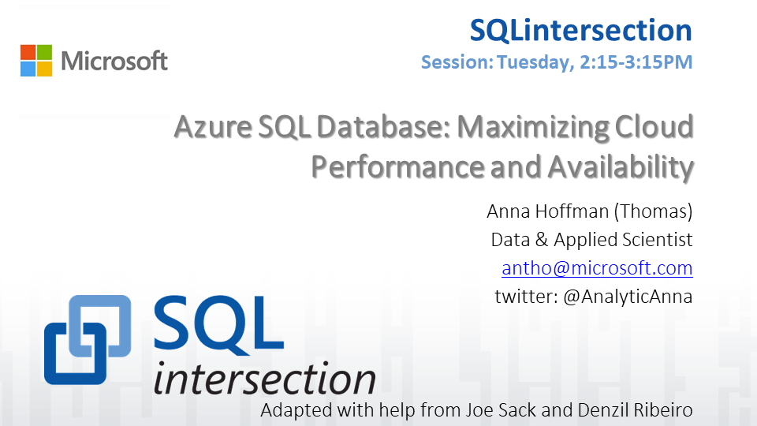

Thanks for joining today. This session is about how you can take what you already know about performance and availability, and apply it to your databases in Azure SQL. Additionally, we’ll share a few insights on how you can easily become the expert on perf and availability for Azure SQL.  

Now we’re combining these two topics together because the conjunction between performance and availability is very important.  

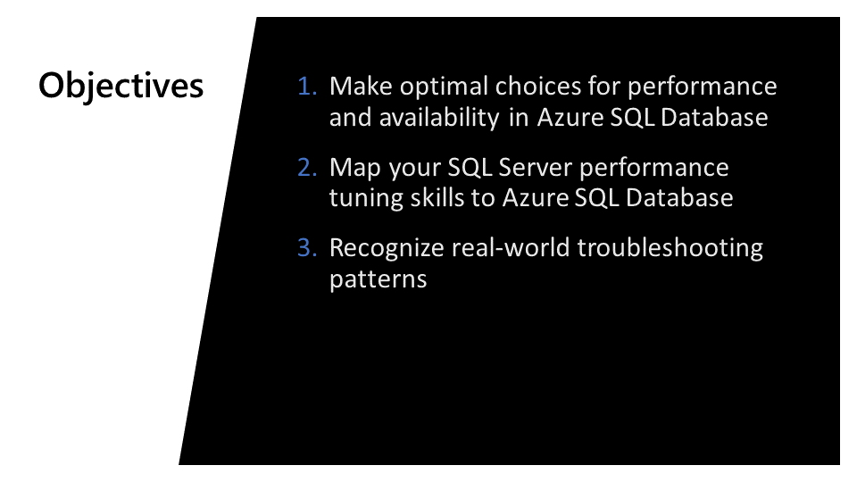

So today we’ll cover three main areas, and these areas are really woven together so you won’t see a clear break between the sections necessarily. We’ve kind of separated these ideas out but they aren’t isolated and sequential.  

We want to start by making sure you understand the intelligent database, intelligent cloud that exists for you in Azure. One of the great things about moving to Azure SQL is that you can just set it and forget it in the cloud. However, there are optimal choices that you can make so you increase the odds that you don’t have to worry about it, and you decrease your costs.  

Let’s start with a poll. How many of you would say you are already an experienced perf and tuning professional? Great. So all of you are about an inch away from being the experts for performance skills in Azure SQL.  

The last aspect, recognizing real world troubleshooting patterns, is based on observations from what we’ve seen as a team on the Azure SQL product team. So, when you have issues, you typically (hopefully) open up a case with CSS. More often than not, they are able to help. If they can’t get to the bottom of it, then they escalate to the engineering team. Our team always has to have a certain number of engineers on call to manage cases that get escalated. What we’ve done today, is pick some of the themes we see and some tips we have around the mitigation and overall productive handling of it.  

So we’ll start today with first principles. Now, if we think about the SQL Server box world. You could learn things when the new version came out, for example when 2005 came out, you learned what was new, you figured out how to work well, and then you knew that would stay the case for the next 1-4 years.  

Well, it’s not like that anymore. In Azure, we change things all the time, and so do our competitors. So, we want to start by laying some ground work around where we are today, so we’re all speaking the same language.  

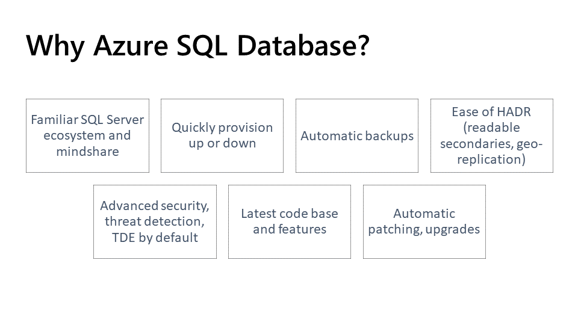

So, we’ll start with, why are customers coming to [Azure SQL database](https://docs.microsoft.com/en-us/azure/sql-database/)?  

It’s a very familiar product, as given by this conference, the many other SQL conferences, and the great community that we have today. Typically, we don’t want to learn something entirely new, but we want to use what we already know and get additional platform benefits. And that’s what Azure SQL does for us.  

So what are some of those benefits? Well, you can scale and prepare for big events, for example Black Friday. You can address this easily, you could even rescale every hour. But preparing and allowing for this on premises is something that is a very different story today.  

You also get things like automatic backups. Now, this isn’t necessarily the most interesting thing, but we do it automatically and you don’t ever have to worry about it.  

Ease of HADR is another example. Now, here, a lot of you may be able to set this up in your sleep. But many customers don’t want to be in the business of doing this. With Azure SQL, you can set it up in less than an hour. Then, we’ll handle it, give you an SLA, and you don’t really have to worry about setting up the topology and infrastructure.  

[Security](https://docs.microsoft.com/en-us/azure/sql-database/sql-database-security-overview) is also a big one. For example, we set up TDE by default. And with Advanced Data Security, you can get additional things like Advanced Threat Detection Alerts, and Vulnerability Assessment scans.  

You also get the latest code base. For example, SQL Server 2019 became generally available recently. However, many of the features released there, were introduced into Azure SQL Database a while ago. We are now running at compatibility 150. We’ll flow in new features over time and you don’t have to worry about it. Making sure you don’t break and only get benefits becomes our responsibility. You also no longer have to worry about patching, upgrading, or worrying about patching and upgrading.  

  

So let’s talk about the [Azure SQL landscape today](https://docs.microsoft.com/en-us/azure/sql-database/sql-database-paas-vs-sql-server-iaas). The way I recommend thinking about it, is what scope do you want? If you want the OS and the instance, Azure SQL in a virtual machine will likely be best. Managed instances are best for lift and shit migrations to the cloud where you don’t need access to the OS, but you still need instance-level features like CLR, Service Broker, SQL Server Agent, etc. Finally, databases are if you just want a database, and for us to take care of the rest. Here we also have options for Hyperscale, which is basically limitless database size, and serverless, which allows for things like pausing your database and only paying for storage.  

Today, we’re going to focused on the more managed side. So we will not be talking about SQL virtual machines, but there is a lot of information available in the documentation around how we can help you increase your performance and availability.  

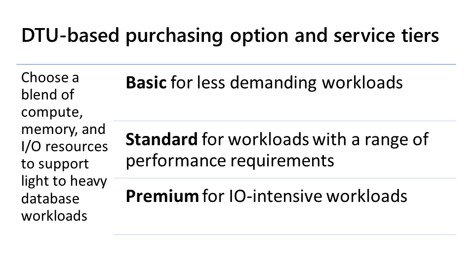

Now, once you select a deployment option, you have [different purchasing options and service tiers](https://docs.microsoft.com/en-us/azure/sql-database/sql-database-purchase-models) that you can choose from. This isn’t meant to make things more complicated for you. Instead, we want to give you the flexibility to get exactly what you need.  

The first purchasing option, that’s shown here, is called a DTU. This basically means, don’t tell me what it is, but just give me a blend of compute, memory, and I/O so I can support my workloads. Now this abstraction works for some customers, but other customers have specific patterns and they may want more granularity into their selections.  

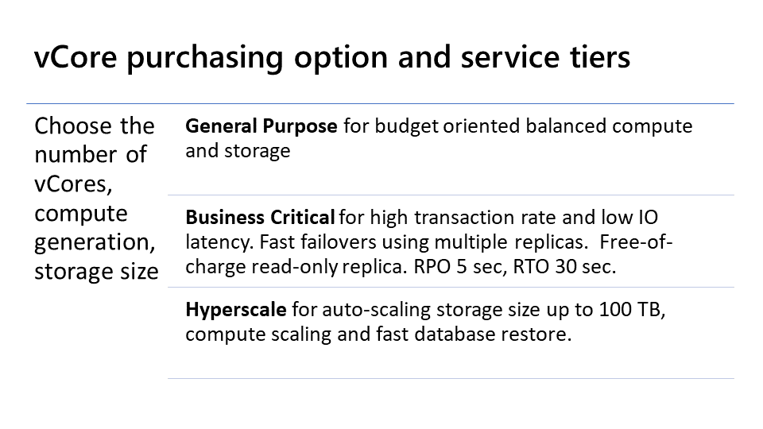  

So, a while after DTUs became a thing, we introduced vCores (virtual cores). We recommend, if you’re starting today, to start with General Purpose within the vCore model. Most of our customers are running in General Purpose and it’s just fine for their workloads. If you end up needing lower latency or a free read-only replica, you might consider using the Business Critical tier. Or, if you need more storage than allowed in Azure SQL, so 4 or 8 TB depending on which deployment option, then you can switch to Hyperscale as needed.  

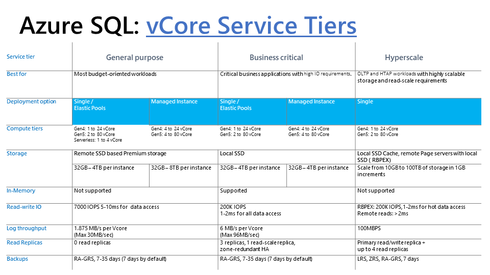  

Now, you’re not meant to consume this today. It’s a very busy visual. However, we want you to know that it exists, and you can find the full details and range of options, that are up to date, [from here](https://docs.microsoft.com/en-us/azure/sql-database/sql-database-vcore-resource-limits-single-databases). This is more of a reference, that tells you what you get as you go from offering to offering, so just keep that in mind.  

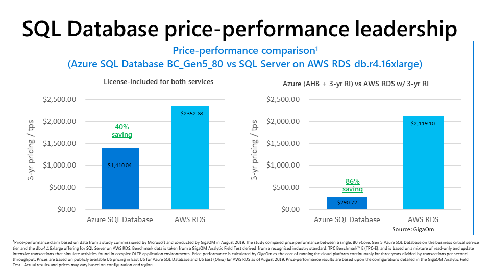

In terms of benchmarking, we’ve been pretty quiet over the last few years, and that’s because the TPC benchmarking wasn’t really built for the cloud. But we are starting to get into it. [This study from GigaOm](https://azure.microsoft.com/mediahandler/files/resourcefiles/sql-transactional-processing-price-performance-testing/GigaOm%20Azure%20SQL%20DB-AWS%20RDS%20Price-Performance%20Benchmark%20Report.pdf) was released in October. One example and industry we have a lot of customers in is the gaming industry. Basically, they need a lot of performance and scale at launch, but then they can usually ramp it back down.  

Now, another thing to note here from this study, is that nothing exactly matched. You can’t really compare apples to apples us with AWS, because there are slight differences among what’s available. One may offer more or less or slightly different.  

One of the key things to point out here, is the additional cost savings you can get from a licensing perspective if you use Azure SQL. If you have licenses on-prem, you can use those, in addition to things like prepaying for reserved capacity, to save a ton on Azure SQL database. So those acronyms are AHB (Azure Hybrid Benefit) and RI (Reserved instances).  

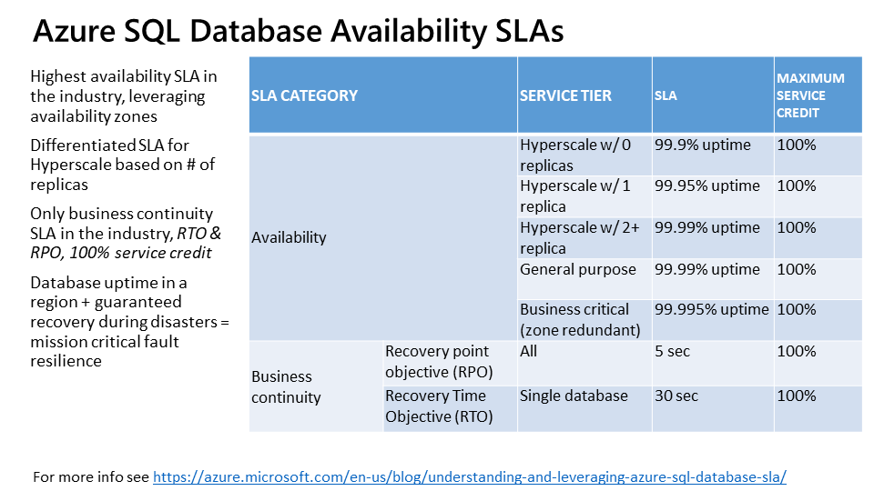

OK one last layer now is [SLAs](https://azure.microsoft.com/en-us/support/legal/sla/sql-database/v1_3/
). We’re almost past the basics here. We have really great SLAs, and we recently even added SLAs for RTO and RPO. Hopefully, you all know the difference between RTO and RPO. Anyone care to explain?  

* RPO stands for recovery POINT objective, i.e., how much data is one potentially prepared and willing to lose, worst case
* RTO stands for recovery TIME objective, i.e., if/when the ‘bad thing’ happens, how much time does it take to be back up and running again.  

Why are we talking about SLAs? Out of the gate, we want to make sure we keep you running. This means that anyone can go and set this up and get great performance by default. And, at the time of this presentation, we are the only folks to have a BCDR type of SLA.  

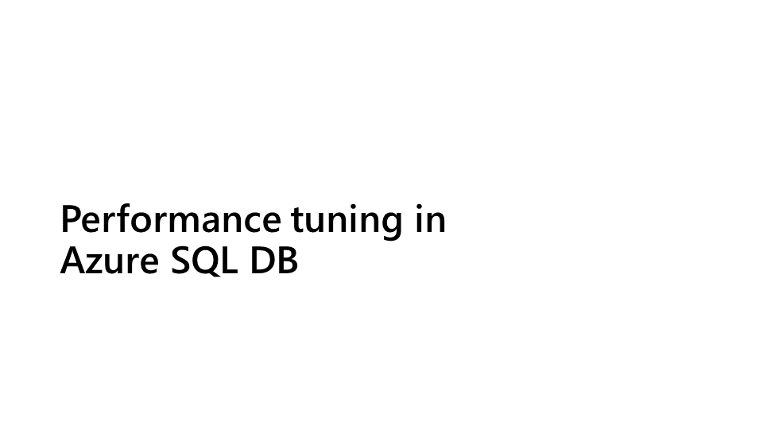

Now, before we go any further, I have a few questions.  

How many are not in cloud today?  
How many are in Azure SQL DB today?  

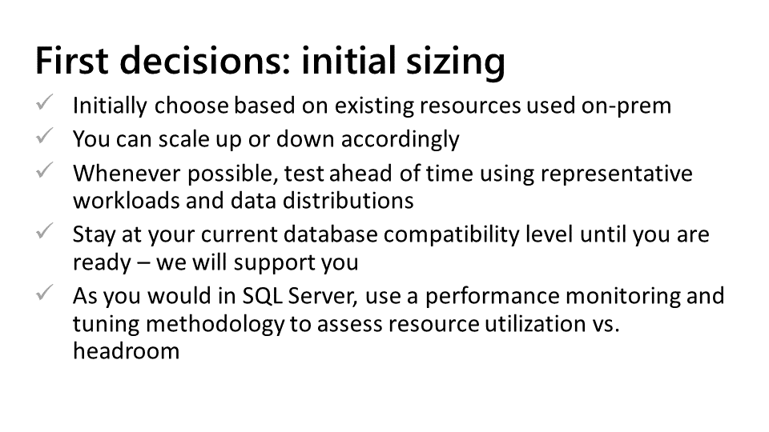

So what we’ve found is that there are patterns around initial sizing. Whatever you do today on-prem or somewhere else, keep it similar when you move. Go with less, and then you can adjust as needed. And, you might think that that’s weird advice coming from Microsoft. But we want you to be right-sized so that you get the full cost benefit of moving, and so that you stay.  

When you have the opportunity, please test your performance ahead of time. We’ve had customers, big customers at that, that decided they’d take their highest, most important workloads, and just move them. And then it’s a really big deal, with a lot of issues. It’s stressful. You don’t want that. We don’t want that. Nobody wins. Make sure you do testing. And we know it’s not always so easy to get a good test workload, but it really is important, so make sure you invest the time to do so. We have a tool within the Data Migration Assistant, that can analyze your workload and make recommendations, it’s called the [SKU Recommender](https://docs.microsoft.com/en-us/sql/dma/dma-sku-recommend-sql-db?view=sql-server-ver15).  

Now that SQL Server 2019 has launched, we will start rolling out the dbcompat of 150 as the default. But, we won’t update you if you’re on, say, 110. You can choose to update if you want, or you can stay at 110, just as you would do with your SQL Server machines on prem today. With finite memory, finite IO, etc., you need to use the performance monitoring and tuning methodology just as you would on-prem to assess things like resource utilization versus headroom. And that’s what we’ll talk more about today.  

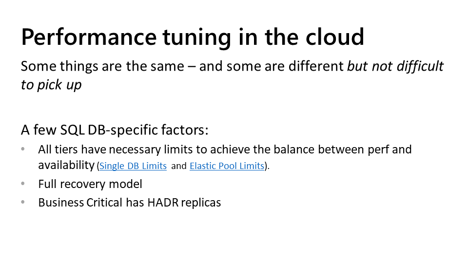
OK so there are some things that are the same, but there are also some things that are different. A few examples: we run in full recovery mode, so if you move from simple recovery to Azure SQL, you’ll see some changes due to that. We also have replicas running, depending on what you set up, so that can be a factor.  

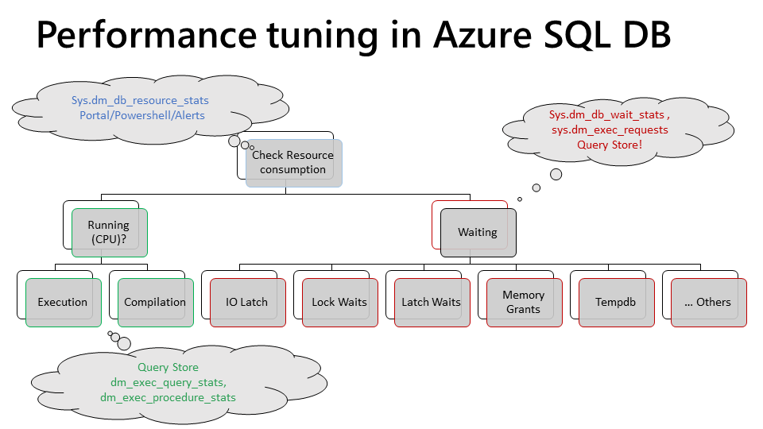

Alright, so let’s say I get woken up at 2AM for some sort of performance issue in Azure SQL Database. Investigating and checking it out is very similar to on-prem. First, we’ll check the resource consumption right, and if there are issues here I want to start there. So I can check sys.dm_db_resource_stats using the Azure Portal, PowerShell or alerts that we might have set up.  

Next, we might check if we are running CPU hot. And if I am, for example let’s say I’m running like 90% over time, I might check, is it execution or compilation overhead? Now we can start to use all our on-prem skills. We can leverage things like the Query Store, dm_exec_query_stats, dm_exec_procedure_stats…  

Now, if we aren’t running hot on CPUs and it was pretty clear it wasn’t compilation or execution, then you can look at wait statistics. We’ll try to find what’s waiting, and we do this the same way that you’d do it on-prem. Leveraging the query store, there are actually certain waits that get stored there too.  

So the only big difference is checking that resource consumption first.  

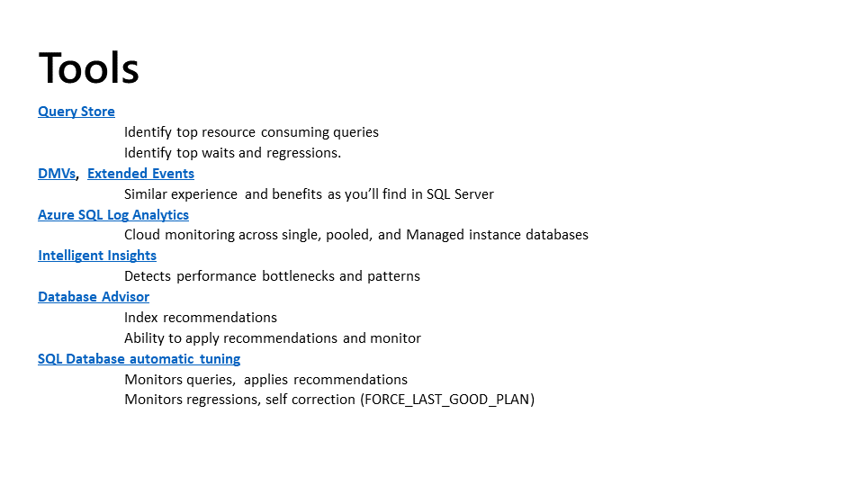

From a tooling perspective, most of these should be pretty familiar to you all, so I won’t spend a lot of time here. I’ll share the resources for where this deck is, so you can look into these later. There are a few others that you might not be familiar with. For example, Azure SQL Analytics, which isn’t exactly built in, you just have to configure from the Azure Marketplace and say that you want it.  

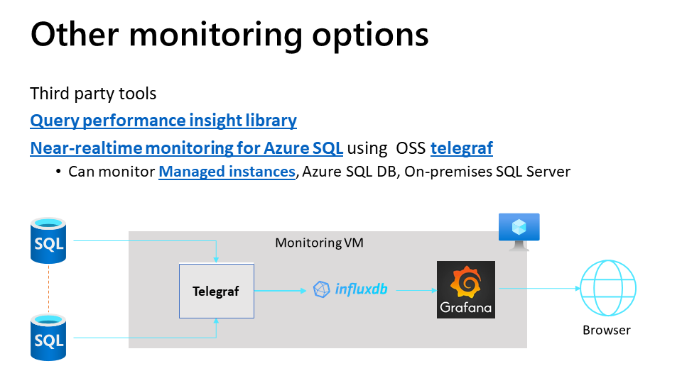

There are other third-party tools as well, which you’ll have access to. One example is a set of scripts developed by Jovan Popavic, who is a Program Manager on the Managed instance team. We’ll take a peek at some of these that you can use in the demos.  

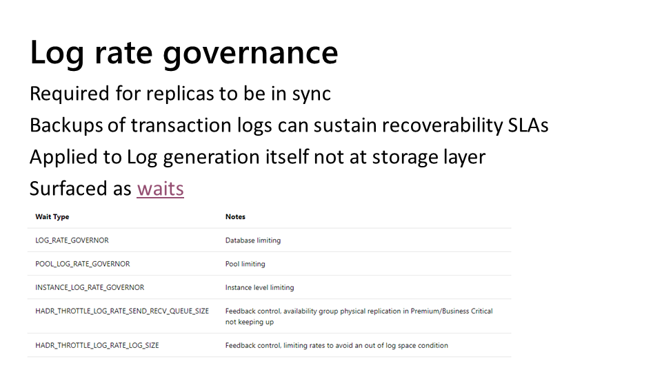

For log rate governance there are a couple of waits, not only the log rate governor. There are ones for pools and instances, as well as limits around HADR. And you can choose to set up alerts depending on what waits are surfaced. Some options available if these arise and more explanations can [be found here](https://docs.microsoft.com/en-us/azure/sql-database/sql-database-resource-limits-database-server#transaction-log-rate-governance).  

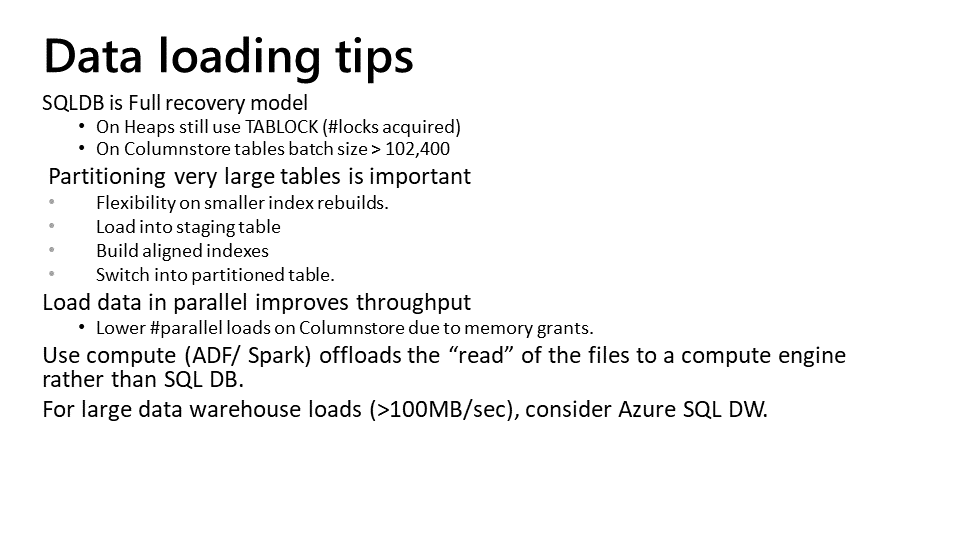

OK let’s go through a few other data loading tips. This was briefly mentioned earlier, but don’t baseline against simple recovery model, because in Azure SQL, we require full recovery model. Things like TABLOCK can help ([minimizes the number of log records for the insert operation](https://docs.microsoft.com/en-us/sql/t-sql/queries/hints-transact-sql-table?view=sql-server-ver15)). You can also use columnstore for large tables and aggregate types of operations. This will help again with generating less into the log. 

Partitioning is very important and something that’s less used among customers. Additionally, loading in parallel is very important for increasing throughput. You shouldn’t do parallel as you would in a heap, because you could hit memory grants. We recommend you start with 4 and see if you’re hitting limits.

You can also leverage things like Azure Data Factory and Spark to offload and read the files. It can be faster and sometimes cheaper to do this than just using SQL DB. And if you have much larger loads, you may consider the data warehousing solution.  

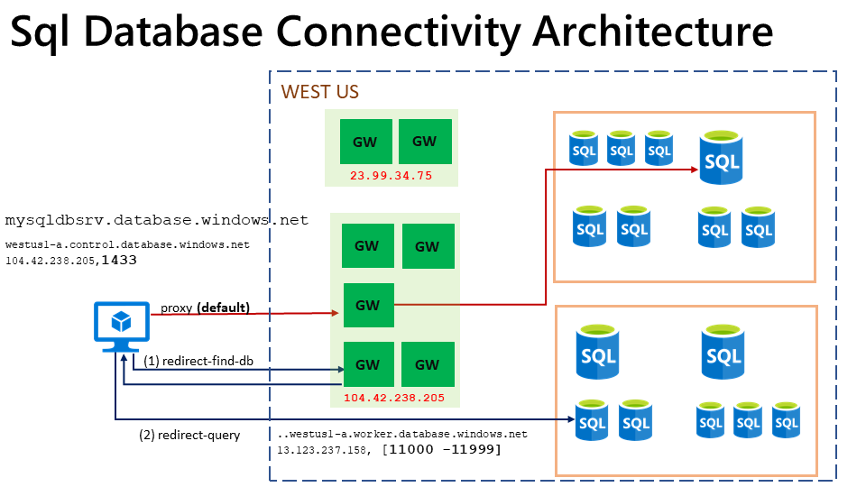

OK so we’ll switch gear slightly and talk about the perspective of a client connection. There are [two main options for how you connect to SQL DB](https://docs.microsoft.com/en-us/azure/sql-database/sql-database-connectivity-architecture), Proxy or Redirect. These are server level settings and apply to all databases.  

Let’s say we have a set of SQL DBs. When the client issues a connection, it goes primarily to the gateway which then routes to a backend connection, which is not visible to the client. This is proxy mode.  

Then, there’s redirect mode in which the initial connection goes through the gateway, but then it returns the actual database connection. So everything after that goes directly to the database. Now, the tradeoff is that you have to open certain outbound ports for this to work 11000-11999, so this will depend on your organization’s policies. But, redirect is better from a performance standpoint.  

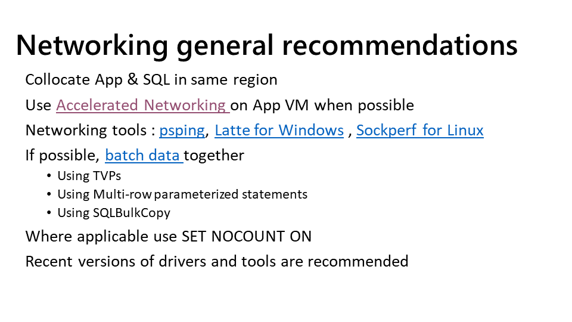

So now let’s talk about some general networking recommendations. You want to collocate you application and SQL databases in the same region. You want to use accelerated networking from your App VM when possible, ideally in the same virtual network.  

If you don’t need to make chatty applications, doing batch or bulk is going to be better.  

If [SET NOCOUNT ON](https://docs.microsoft.com/en-us/sql/t-sql/statements/set-nocount-transact-sql?view=sql-server-ver15) is applicable, it can greatly reduce the network traffic and increase performance.  

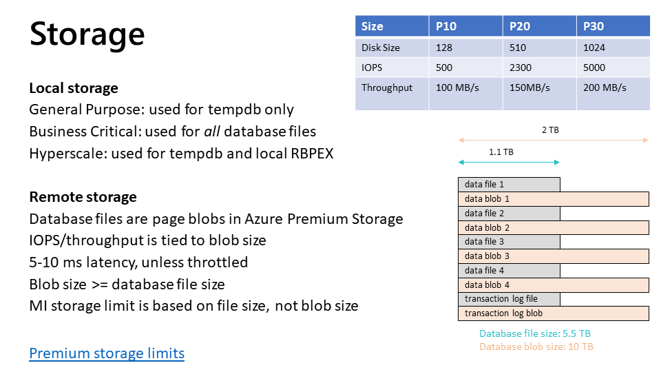

Let’s move on and talk about storage. Local storage (directly attached SSDs or MVMEs) is used for your SQL database depending on the service tier. With GP, it’s only for tempdb, for BC, it’s used for all your database files, and for Hyperscale, it’s used for tempdb and local RBPEX.

There’s also remote storage, which is remote and not local. The IOPS there are tied to a blob storage size, so if you have a P10 size the IOPS limits are the same. There are different limits but you can read exactly what they are like throughput limits, so the blob size really matters. We’ll see a demo of how that can change things.  

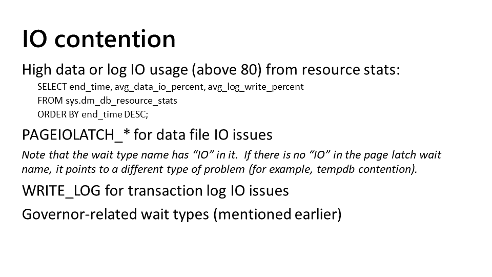

We talked earlier about the wait types you want to look at, and here are a few related to IO (including PAGEIOLATCH_SH, PAGEIOLATCH_EX,PAGEIOLATCH_UP). The key is that IO will be in the name of the wait type. You can also look at the WRITE_LOG and the governor related wait types we talked about earlier.  

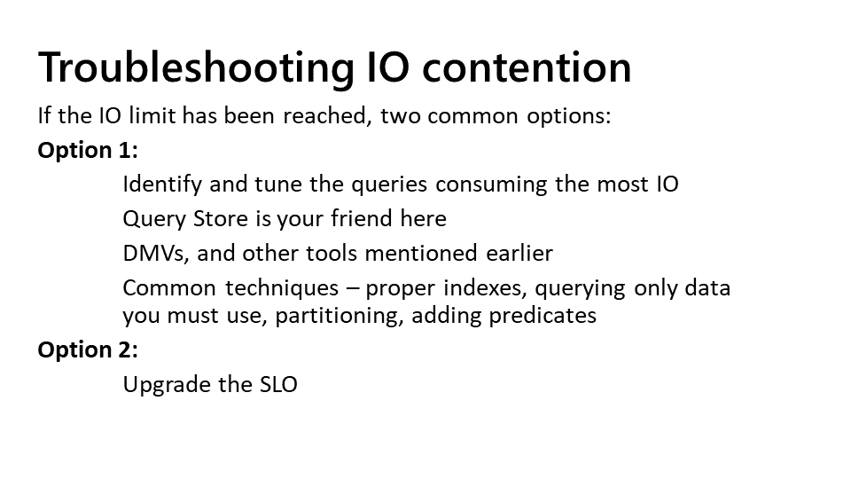

In terms of troubleshooting, it should be very familiar and similar to what you usually would do. The methods that work in the box will work in the cloud. Some basic things like to check things, leverage the DMVs and Query store, other best practices.  

Now if you can’t tune it or change it any further, and you still aren’t getting the performance you need, updating the SLO, to something like the Business Critical tier is an option. A lot of times, we see customers that skip to option 2, without fully exploring option 1. With some tuning, the people in this room could save folks a lot of money on their SQL deployments in Azure.  

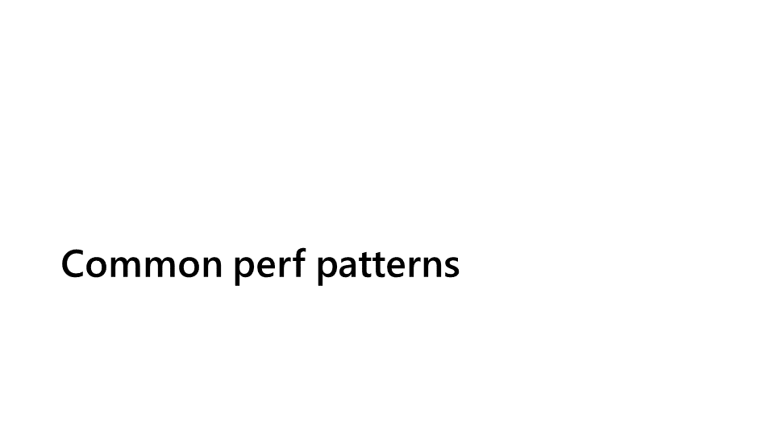

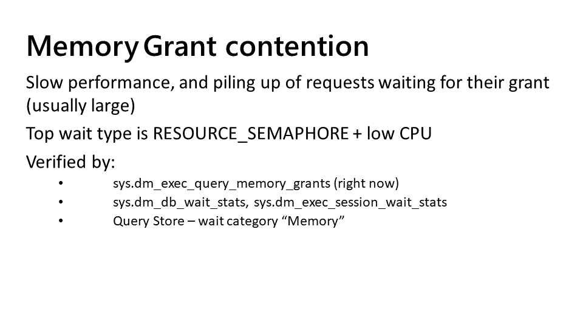

SELECT * FROM Table1 ORDER BY Column1 OPTION (min_grant_percent = 10, max_grant_percent = 50)  

[Memory grant contention is pretty similar to what you see on-prem](https://docs.microsoft.com/en-us/sql/relational-databases/system-dynamic-management-views/sys-dm-exec-query-memory-grants-transact-sql?view=sql-server-ver15). You’ll see slow performance and a piling of requests that are waiting for their grant.   

Now, if you’re doing things like has operations or multiple concurrent requests, you can start gating, and this is verifiable. This is a common pattern you’ll see on-prem too.  

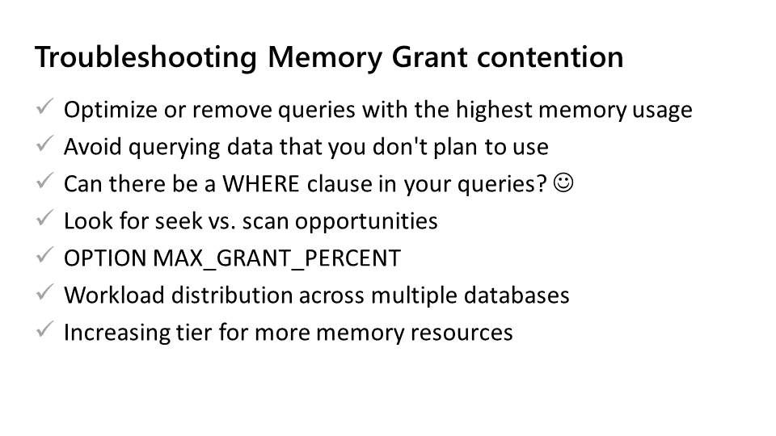

So what do you do if you have a memory grant contention? Don’t jump to the most complicated remediation. Oftentimes, you can address these by making simple changes. For example, maybe you’re missing a where clause. Using the same rules that you would in SQL Server box will help you here.  

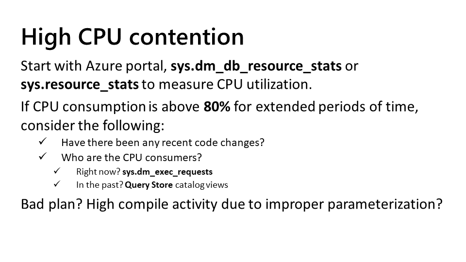

Now if you have a high CPU contention, similar to the workflow we saw at the beginning, you can start in the Azure portal first. And then you can check things like sys.dm_db_resource_stats or sys.resource_stats to measure the CPU utilization. If it’s consistently 80% or higher, there are some questions to ask – any recent code changes? Who are the CPU consumers? And finally, it might be a bad plan.  

You might have had a good plan that was fine, but then for whatever reason the plan goes away and the new plan, for whatever reason, is not good. Automatic tuning can help by getting the last good plan. This is very popular and it is simple in it’s functionality. If you don’t want to use it, you can use DMVs to see it.  

High compilation activity can cause some issues too. Automatic tuning can also make recommendations around parameterizing your queries.  

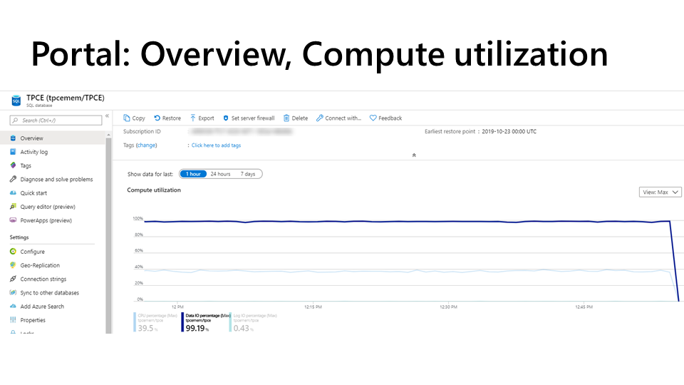

Alright so as we get near the end of this session, you might be thinking, “OK great, I can do all that”. Or, you might be thinking “Actually, no, I don’t want to do any of that”. So, I wanted to show you a few things that are available in the portal that can help at a general level.  

The first thing is the overview blade in the portal. This is the most popular blade in the Azure portal. Immediately you can analyze your compute utilization.  

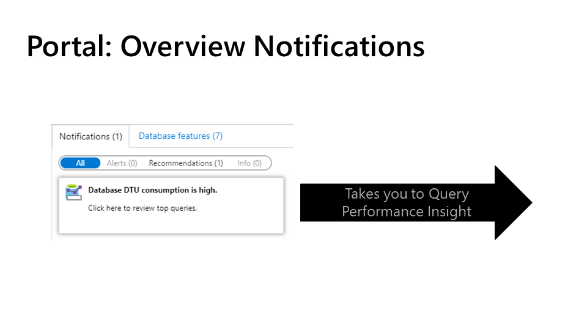

If you scroll down, you’ll see something called recommendations, and if you click on it, you’ll be brought to QPI.  

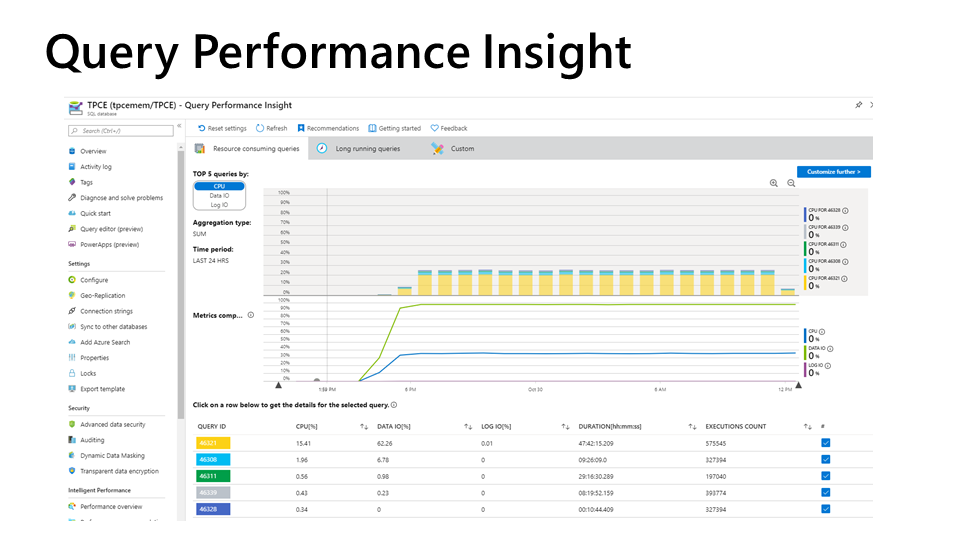

Form here, you can check in and see the top 5 queries by dimension of resources used, and you can click all the way through the getting the actual query text and its history.  

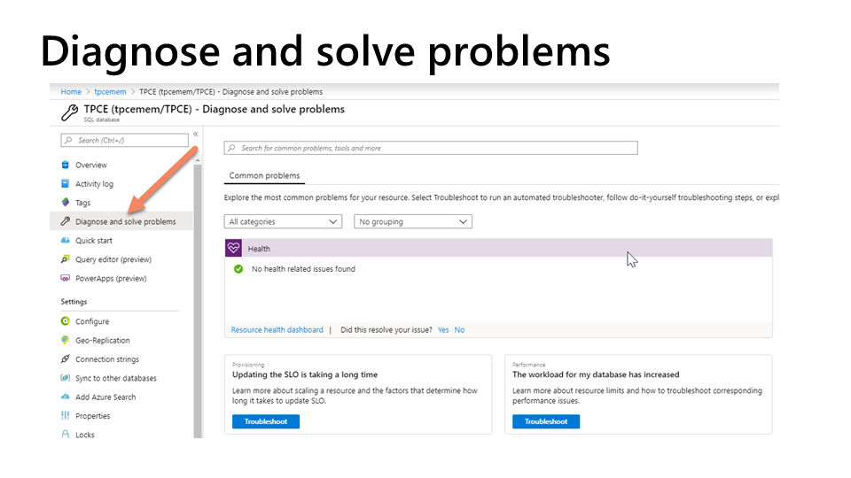

One other thing which is not talked about a lot and is ever evolving is the “Diagnose and solve problems” blade. This is based on cases we see. We’ll show you the health insights for your database, or anything else that’s going on in Azure. You might even get some insights if we predict or see anything that we think could improve your situation.  

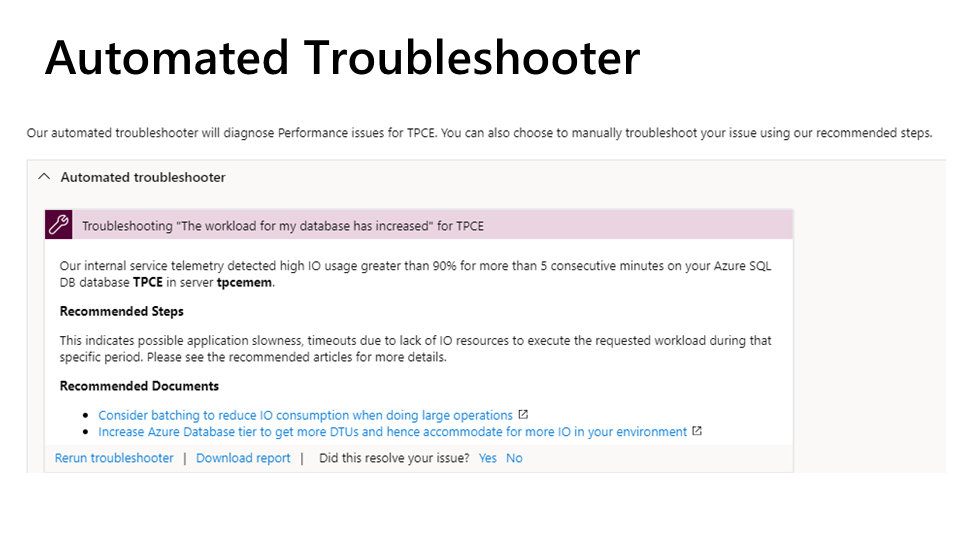

For example, and this is above and beyond query performance insights, there’s an automated troubleshooter that can give recommendations. And this again is something we’re always evolving based on the things that we notice.  

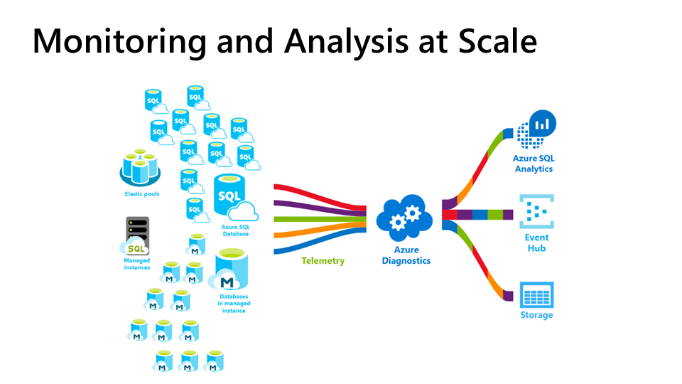

Now let’s say you’re monitoring at scale, and you have thousands on managed instances or single databases or elastic pools, etc. Azure SQL Analytics can help. You can monitor them all through one pane. We collect a lot of telemetry and you can use Azure SQL Analytics to view it, or you can take it to other places like storage or event hubs for further data driven decision-making. But with Azure SQL Analytics, we make a dashboard for you.  

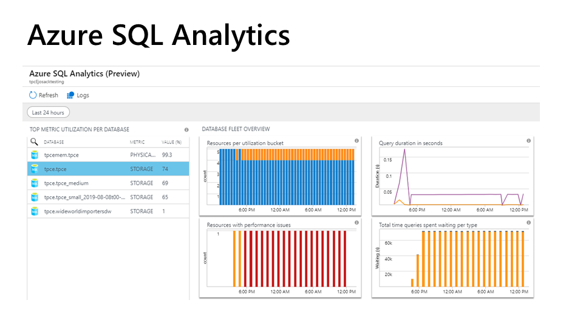

You can see a heatmap and you can click through to get to the actual top issue. This isn’t exactly included in your deployment. You have to add it through the Azure Marketplace, and then you just have to pay for the storage.  

Now intelligent insights can also help you. We have built a set of advanced statistical models that are based on telemetry data, and it can help. We’ll provide custom insights based on your workloads when possible.  

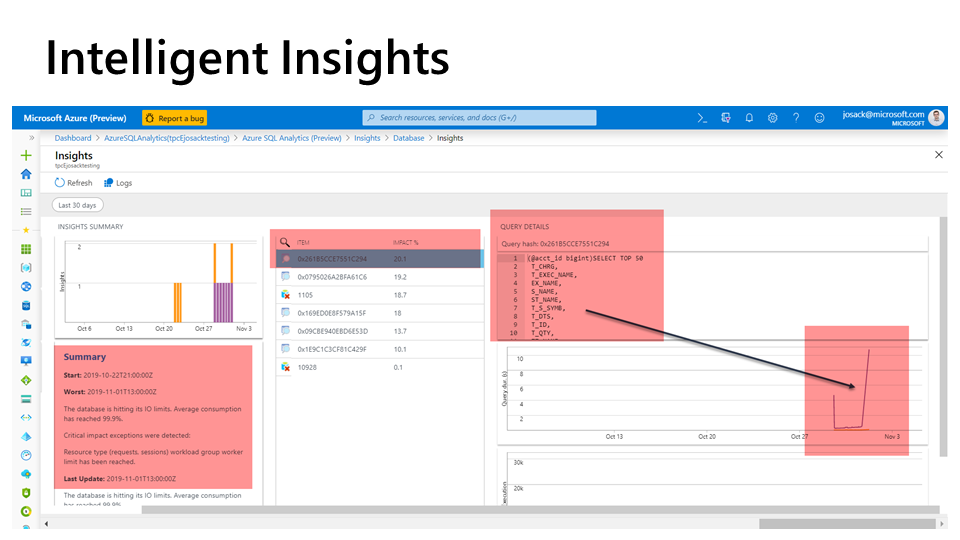

Example of insights.  

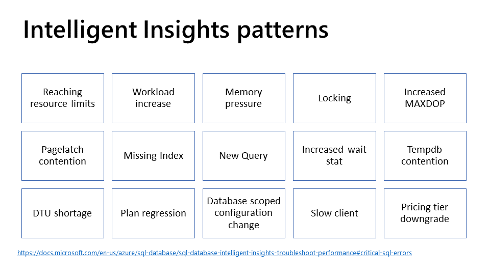

These are the patterns we can automatically identify. Even if you don’t plan on using this feature, you should still check out this documentation page because it’s a [great runbook containing an operational guide](https://docs.microsoft.com/en-us/azure/sql-database/sql-database-intelligent-insights-troubleshoot-performance#critical-sql-errors
) of what we can identify and what we recommend.  

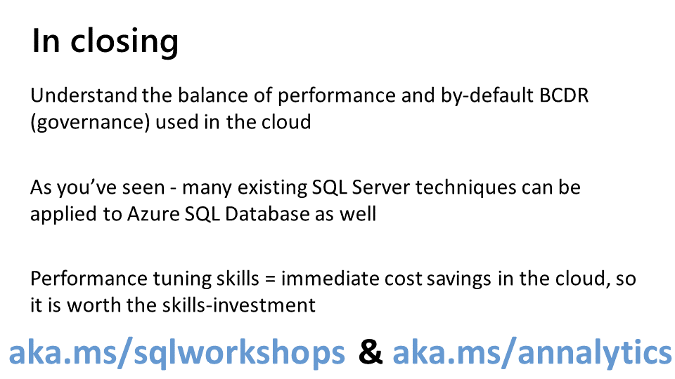

So we’ve given a pretty wide tour of the availability landscape and the performance landscape, hopefully you’ve learned something knew. But also, we hope you’re now feeling confident that your SQL Server skills are very much relevant in Azure SQL database. We’re in this time where the Hybrid DBA is more and more common, and I think you all can greatly contribute to what we’re doing here.  

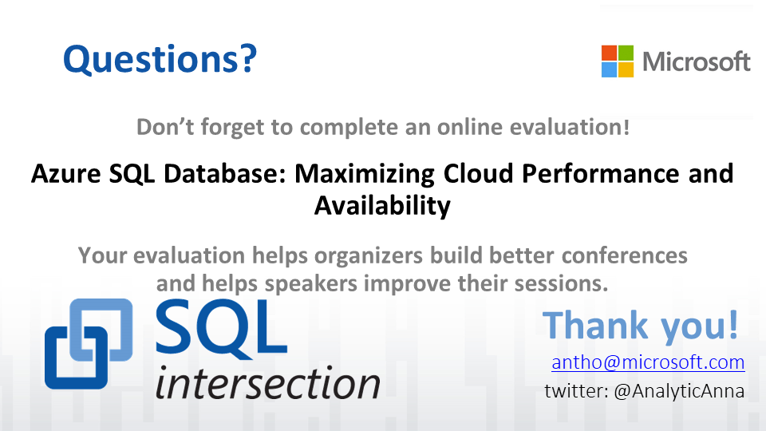  

