```{r setup, include=FALSE}
knitr::opts_chunk$set(echo = TRUE)
```

# Using R with Azure SQL DB for Wine Quality 

## Use a regression to predict wine quality


I will use [wine quality data set](https://archive.ics.uci.edu/ml/machine-learning-databases/wine-quality/winequality-red.csv)
from the [UCI Machine Learning Repository](https://archive.ics.uci.edu/ml/datasets.html).  
The dataset contains quality ratings (labels) for a wine samples. 
The features are the wines' physical and chemical properties (11 predictors). 
We want to use these properties to predict the quality of the wine. 

*Sources:* 

- [ML with the UCI Wine Quality Dataset, Garry Malloy](http://rpubs.com/garrym3k/175762)
- [Red and White Wine Quality, Daria Alekseeva](https://rpubs.com/Daria/57835)
  


Processing the data
-------------------

### Connecting to SQL

Let's start with collecting and preparing the data. I've created a database called `WineQuality` within my SQL Server instance on a Linux VM. So I'll import osme packages, and then connect to SQL Server.  

Once we're connected, I can set the compute context to my SQL Server instance, so that no data is moved and all analysis is done within SQL Server.


First, let's grab the necessary packages and connect to our Azure SQL DB.

```{r}
library(RODBC)
library(RODBCext)
library(sqlmlutils)
connection <- connectionInfo(server= "antho.database.windows.net", 
    database = "WineQuality", uid = "sqladmin", pwd = "REMOVED")
#sql_install.packages(connectionString = connection, pkgs = "glue", verbose = TRUE, scope = "PUBLIC")
```
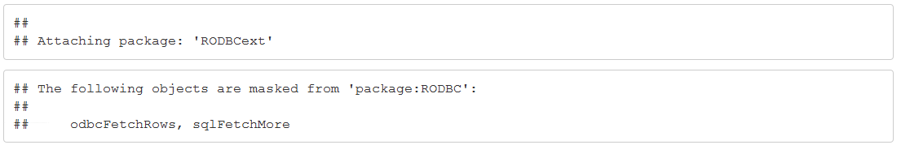

Next, let's verify that the `glue` package was installed.
```{r} 
r<-sql_installed.packages(connectionString = connection, fields=c("Package", "LibPath","Attributes", "Scope"))
View(r)
```

I found some great resources on RPubs (see references at beginning). But for the purposes of this exercise, we have to slightly alter our R code to run in-database in Azure SQL DB, so we'll walk through how to do that.

First, the RxInSqlServer constructor to create the compute context object with the variables and connection strings defined, and save the new object in the R variable sqlcc.
```{r}
sqlShareDir <- paste("C:\\AllShare\\",Sys.getenv("USERNAME"),sep="")
sqlWait <- TRUE
sqlConsoleOutput <- FALSE
sqlcc <- RxInSqlServer(connectionString = connection, shareDir = sqlShareDir, wait = sqlWait, consoleOutput = sqlConsoleOutput)
rxSetComputeContext(sqlcc)
rxGetComputeContext()
```
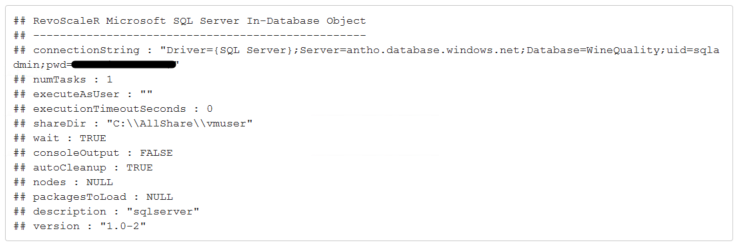
A few notes, taken from the documentation:
- R uses a temporary directory when serializing R objects back and forth between your workstation and the SQL Server computer. You can specify the local directory that is used as sqlShareDir, or accept the default.
- Use sqlWait to indicate whether you want R to wait for results from the server. For a discussion of waiting versus non-waiting jobs, see [distributed and parallel computing with RevoScaleR in Microsoft R](https://docs.microsoft.com/r-server/r/how-to-revoscaler-distributed-computing).
- Use the argument sqlConsoleOutput to indicate that you don't want to see output from the R console.

### Create a data source

Let's create some queries that we'll use throughout.
```{r}
wine_query <- "SELECT * FROM [WineQuality].[dbo].[wine_data]"
red_query <- "SELECT * FROM [WineQuality].[dbo].[wine_data] WHERE color = 'red'"
white_query <- "SELECT * FROM [WineQuality].[dbo].[wine_data] WHERE color = 'white'"
```

Next, you'll want to pass the queries with `RxSqlServerData`
```{r}
inDataSource <- RxSqlServerData(
  sqlQuery = wine_query,
  connectionString = connection,
  colClasses = c(facidity = "numeric", vacidity = "numeric",
  citric = "numeric", sugar = "numeric",chlorides = "numeric", fsulfur = "numeric",
  tsulfur = "numeric", density = "numeric",pH = "numeric", sulphates = "numeric",
  alcohol = "numeric", quality = "numeric", color="character"),
  rowsPerRead=500
  )
rxGetVarInfo(data = inDataSource)
```
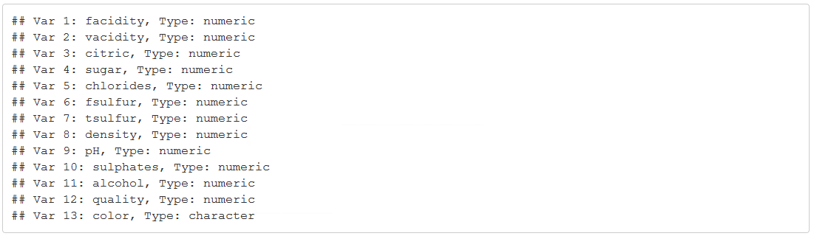
To make it easier for us, we can also set up our separate red and white wine information data sources.
```{r}
inDataSource_red <- RxSqlServerData(
  sqlQuery = red_query,
  connectionString = connection,
  colClasses = c(facidity = "numeric", vacidity = "numeric",
  citric = "numeric", sugar = "numeric",chlorides = "numeric", fsulfur = "numeric",
  tsulfur = "numeric", density = "numeric",pH = "numeric", sulphates = "numeric",
  alcohol = "numeric", quality = "numeric", color="character"),
  rowsPerRead=500
  )
inDataSource_white <- RxSqlServerData(
  sqlQuery = white_query,
  connectionString = connection,
  colClasses = c(facidity = "numeric", vacidity = "numeric",
  citric = "numeric", sugar = "numeric",chlorides = "numeric", fsulfur = "numeric",
  tsulfur = "numeric", density = "numeric",pH = "numeric", sulphates = "numeric",
  alcohol = "numeric", quality = "numeric", color="character"),
  rowsPerRead=500
  )
```

Let's look at the first few rows for red and white.

```{r}
head(inDataSource_red)
```
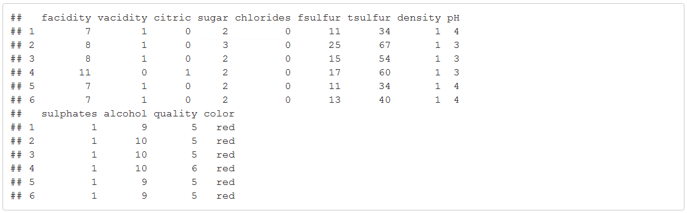
```{r}
head(inDataSource_white)
```
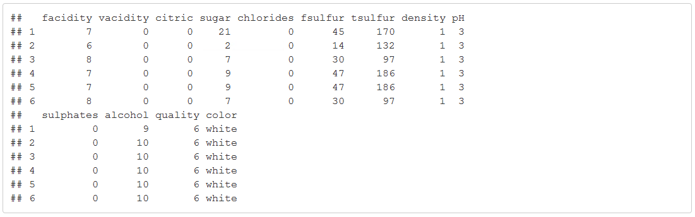

```{r}
rxHistogram(~ quality , data = inDataSource_red, numBreaks = 6, title="Histogram of Red Wine Qualities")
```
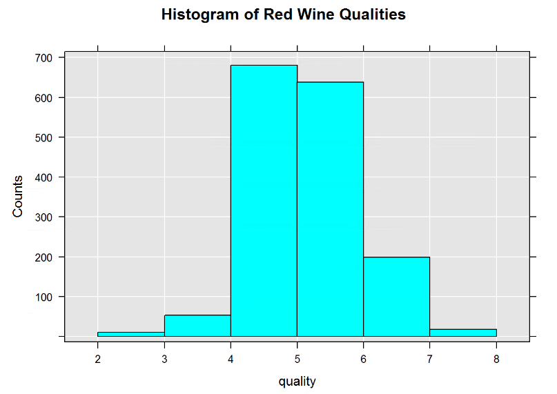
```{r}
rxHistogram(~ quality , data = inDataSource_white, numBreaks = 7, title="Histogram of White Wine Qualities")
```
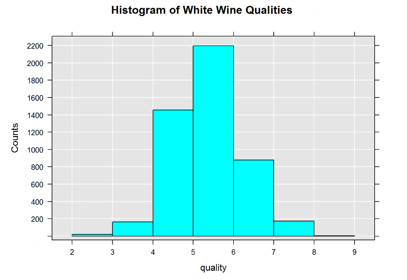

For this example, we used T-SQL in SSMS to split the data and prepare our table to save the model. 
```sql
/* Split data into training and testing sets */
DROP PROCEDURE IF EXISTS TrainTestSplit;
GO

CREATE PROCEDURE [dbo].[TrainTestSplit] (@pct int)
AS

DROP TABLE IF EXISTS dbo.wine_sample_training
SELECT * into wine_sample_training FROM WineQuality.dbo.wine_data WHERE (ABS(CAST(BINARY_CHECKSUM(facidity)  as int)) % 100) < @pct

DROP TABLE IF EXISTS dbo.wine_sample_testing
SELECT * into wine_sample_testing FROM WineQuality.dbo.wine_data
WHERE (ABS(CAST(BINARY_CHECKSUM(facidity)  as int)) % 100) > @pct
GO

EXEC TrainTestSplit 75
GO

/* Create stored procedure and table to save models */
DROP TABLE IF EXISTS dbo.wine_quality_models;
GO

CREATE TABLE dbo.wine_quality_models (
    model_name varchar(255),
    model varbinary(max)
);
GO

IF EXISTS (SELECT * FROM sys.objects WHERE type = 'P' AND name = 'PersistModel')
  DROP PROCEDURE PersistModel
GO

CREATE PROCEDURE [dbo].[PersistModel] @m nvarchar(max)
AS
BEGIN
	-- SET NOCOUNT ON added to prevent extra result sets from
	-- interfering with SELECT statements.
	SET NOCOUNT ON;
	insert into dbo.wine_quality_models (model) values (convert(varbinary(max),@m,2))
END
GO
```

Next, we just have to train the model. In Python, we used the revoscale package for Fast Trees. Here, we'll try boosted decision trees with `rxBTrees`.
```{r}
training_query <- "SELECT facidity, vacidity, citric, sugar, chlorides, fsulfur,tsulfur, density, pH, sulphates, alcohol, quality FROM [WineQuality].[dbo].[wine_sample_training]"
training_data <- RxSqlServerData(
  sqlQuery = training_query,
  connectionString = connection,
  colClasses = c(facidity = "numeric", vacidity = "numeric",
  citric = "numeric", sugar = "numeric",chlorides = "numeric", fsulfur = "numeric",
  tsulfur = "numeric", density = "numeric",pH = "numeric", sulphates = "numeric",
  alcohol = "numeric", quality = "numeric"),
  rowsPerRead=500
  )

set.seed(1234)
btree.formula <- quality ~ facidity + vacidity + citric + sugar + chlorides + fsulfur + tsulfur + density + pH + sulphates + alcohol
btrees <- rxBTrees(btree.formula, data = training_data, maxDepth = 7, minSplit = 2, nTree = 50, lossFunction = "gaussian", learningRate = 0.1)
btrees
plot(btrees)
```
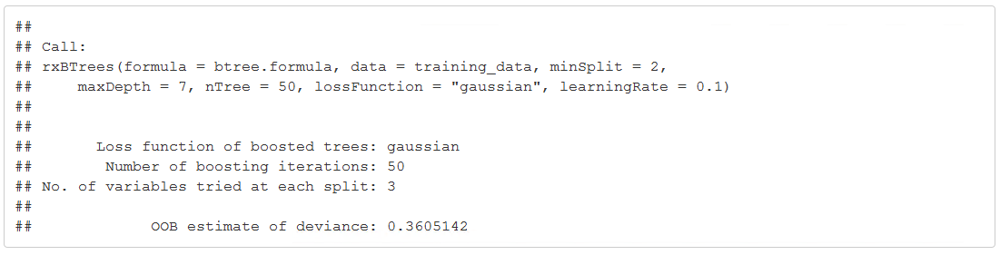
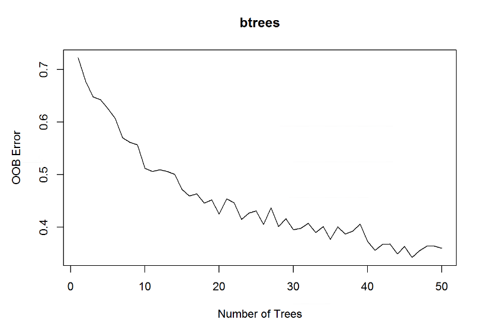
Awesome. So we have a model, and now we want to see how it performs on unseen data, so we'll use our testing dataset for that.
```{r}
testing_query <- "SELECT facidity, vacidity, citric, sugar, chlorides, fsulfur,tsulfur, density, pH, sulphates, alcohol, quality FROM [WineQuality].[dbo].[wine_sample_testing]"
testing_data <- RxSqlServerData(
  sqlQuery = training_query,
  connectionString = connection,
  colClasses = c(facidity = "numeric", vacidity = "numeric",
  citric = "numeric", sugar = "numeric",chlorides = "numeric", fsulfur = "numeric",
  tsulfur = "numeric", density = "numeric",pH = "numeric", sulphates = "numeric",
  alcohol = "numeric", quality = "numeric"),
  rowsPerRead=500
  )

scoredOutput <- RxSqlServerData(connectionString = connection, table = 'rModelScoreOutput')
btrees.pred <- rxPredict(modelObject = btrees, data = testing_data, outData = scoredOutput, predVarNames = 'Score', type = 'response', writeModelVars = TRUE, overwrite = TRUE)
first <- head(btrees.pred,20)
first[,1:2]
```
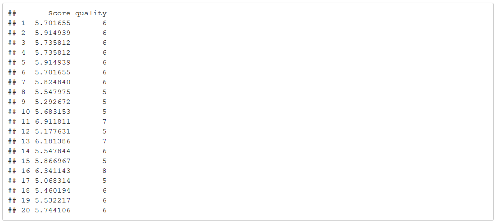
Now, let's turn it into a stored procedure in SQL using `sqlmlutils`.
```{r}
library(sqlmlutils)

spPredict <- function(inputDataFrame) {
    library(RevoScaleR)
    btree.formula <- quality ~ facidity + vacidity + citric + sugar + chlorides + fsulfur + tsulfur + density + pH + sulphates + alcohol
  model <- rxBTrees(btree.formula, data = training_data, maxDepth = 7, minSplit = 2, nTree = 50, lossFunction = "gaussian", learningRate = 0.1)
  rxPredict(model, inputDataFrame)
}

inputParams <- list(inputDataFrame = "Dataframe")

name = "SProcPredictionR"
dropSproc(connectionString = connection, name = name)

createSprocFromFunction(connectionString = connection, name = name, func = spPredict, inputParams = inputParams)
stopifnot(checkSproc(connectionString = connection, name = name))
```
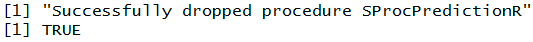